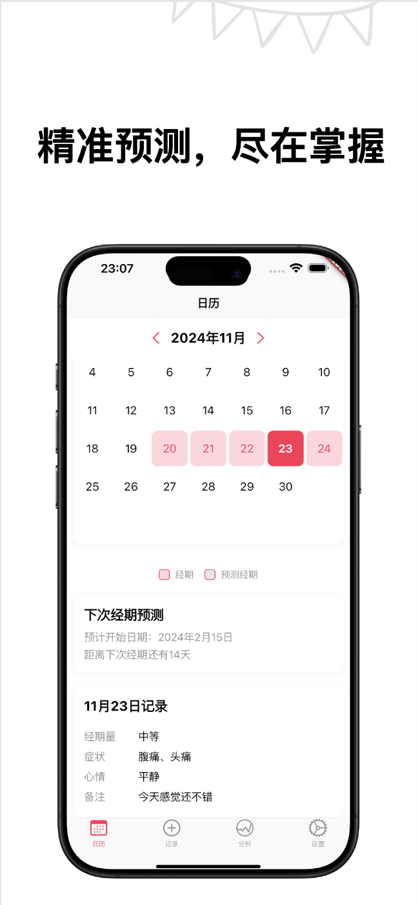
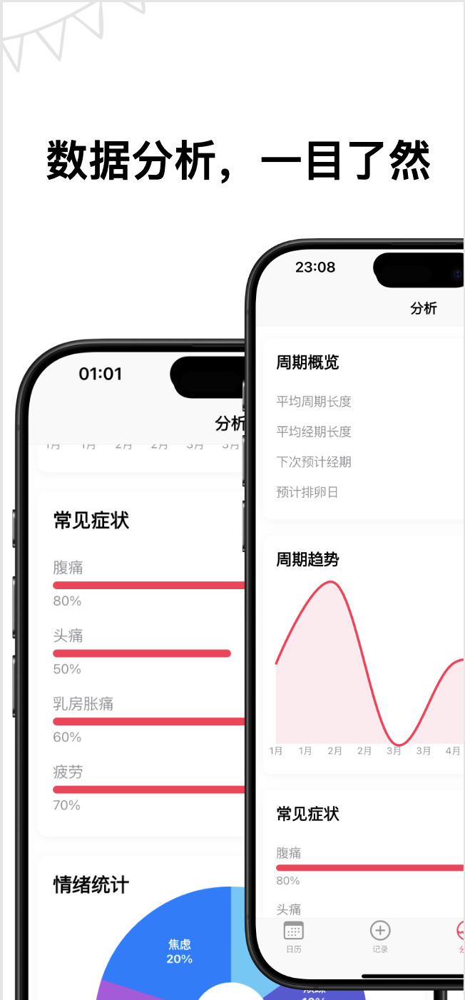
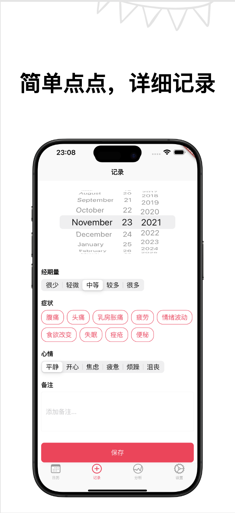
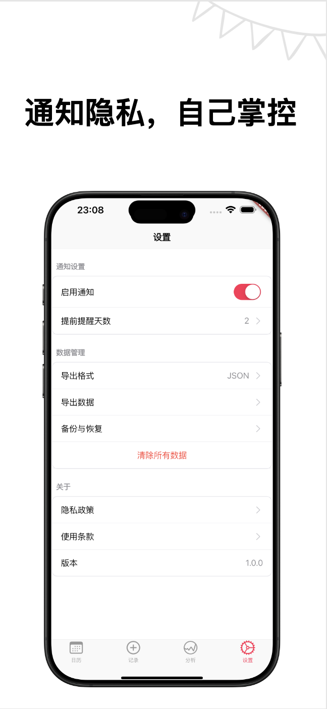

# i_health - iOS 经期追踪应用

<div align="center">
  
</div>

i_health 是一款专为 iOS 设计的经期追踪应用，采用 Flutter 框架开发，提供直观的界面和全面的经期管理功能。注重隐私保护，所有数据均存储在本地。


<div align="center" style="display: flex; justify-content: space-around; flex-wrap: nowrap; gap: 10px;">
  
  
  
  
</div>

## ✨ 功能特点

### 📅 日历功能
- 自定义日历视图，支持经期标记
- 经期日期选择和导航
- 经期天数高亮显示
- 下次经期预测
- 每日详细记录查看

### ✍️ 记录功能
- 全面的经期记录系统
- 日期选择器
- 经期流量强度选择
- 多重症状选择
- 心情记录
- 备注功能
- 记录保存功能

### 📊 数据分析
- 周期概览统计
- 周期趋势线图
- 症状频率柱状图
- 心情分布饼图

### ⚙️ 设置选项
- 通知偏好设置
- 数据导出/导入
- 数据备份/恢复
- 隐私政策
- 使用条款

## 🛠 技术特点

- 🎯 专为 iOS 平台优化
- 🎨 采用 Cupertino 设计语言
- 💾 本地数据存储 (Hive)
- 🔔 本地通知系统
- 🔒 注重隐私保护
- 📱 响应式设计

## 📱 系统要求

- iOS 11.0 或更高版本
- iPhone 设备
- 仅支持竖屏模式

## 📦 主要依赖

```yaml
dependencies:
  flutter:
    sdk: flutter
  hive: ^2.2.3
  hive_flutter: ^1.1.0
  intl: ^0.18.1
  provider: ^6.0.5
  fl_chart: ^0.66.0
  flutter_local_notifications: ^16.3.0
  timezone: ^0.9.2
  shared_preferences: ^2.2.2
  path_provider: ^2.1.2
  csv: ^5.1.1
  url_launcher: ^6.2.3
  share_plus: ^7.2.1
  file_picker: ^6.1.1
```

## 🚀 开始使用

1. 克隆项目
```bash
git clone https://github.com/dweb-channel/i-health.git
```

2. 安装依赖
```bash
flutter pub get
```

3. 运行应用
```bash
flutter run
```

## 📝 文档

- [隐私政策](assets/privacy_policy.html)
- [使用条款](assets/terms_of_service.html)

## 🔒 隐私保护

i_health 高度重视用户隐私：
- 所有数据仅存储在本地设备
- 不收集任何用户个人信息
- 不上传数据到云端
- 支持数据导出和备份

## 🤝 贡献

欢迎提交 Issue 和 Pull Request！

## 📄 许可证

本项目采用 MIT 许可证 - 查看 [LICENSE](LICENSE) 文件了解详情
